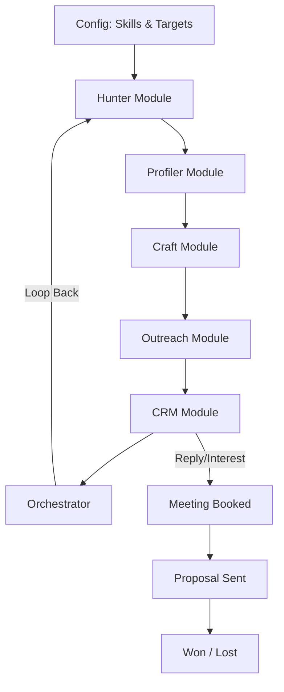
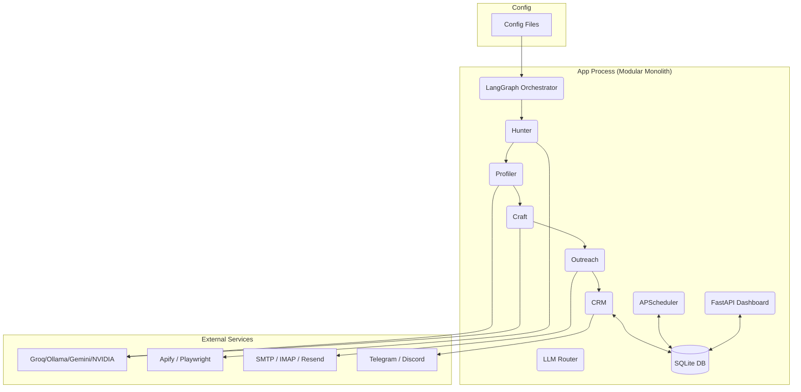
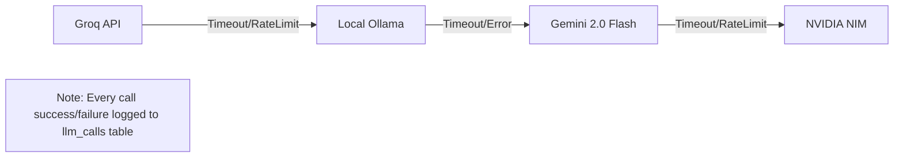
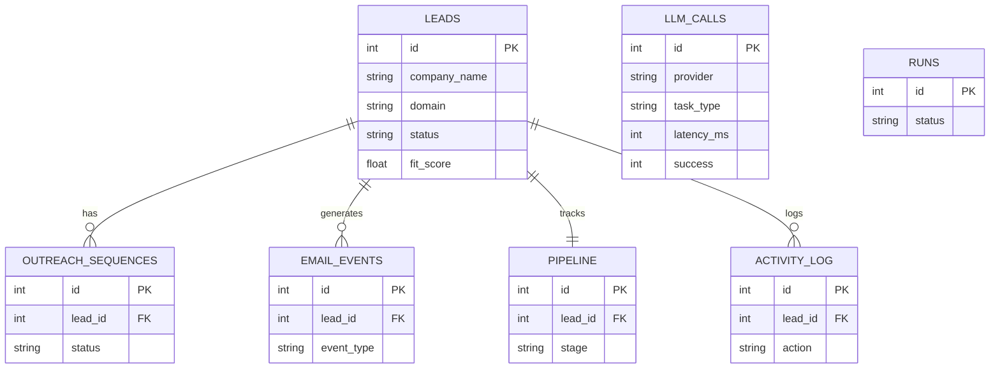

# ContractorOS

> A locally-run, fully agentic client-acquisition engine for solo technical contractors — it finds leads, researches them, writes personalized cold outreach, sends and follows up automatically, and tracks the whole deal pipeline in a built-in CRM. No SaaS subscriptions, no cloud lock-in.


## Table of Contents
1. [Overview](#overview)
2. [Core Loop](#core-loop)
3. [System Architecture](#system-architecture)
4. [Module Breakdown](#module-breakdown)
5. [Pipeline Lifecycle](#pipeline-lifecycle)
6. [LLM Router Fallback](#llm-router-fallback)
7. [Database Schema](#database-schema)
8. [Tech Stack](#tech-stack)
9. [Project Structure](#project-structure)
10. [Getting Started](#getting-started)
11. [Configuration](#configuration)
12. [Safety & Manual Review](#safety--manual-review)
13. [Cost Estimate](#cost-estimate)
14. [Roadmap / Build Phases](#roadmap--build-phases)
15. [Scale-Out Path](#scale-out-path)
16. [License](#license)
17. [Disclaimer](#disclaimer)

## Overview
Solo contractors (software, cybersecurity, AI, DevOps freelancers) spend enormous unpaid time on prospecting — finding companies, researching them, writing outreach, following up, tracking replies. 

**ContractorOS** automates the entire top-of-funnel sales motion end-to-end as a single local application, so the contractor only steps in for the human parts: reading replies, booking calls, writing proposals, closing deals. 

It runs locally on your machine, eliminating expensive monthly subscriptions and cloud lock-in.

## Core Loop


## System Architecture


## Module Breakdown
### 1. Hunter
Acquires raw leads and normalizes data.
- **Responsibilities:** Executes scraping routines (Apify Google Maps, website extractors, Hunter.io) or manual CSV imports. Deduplicates on normalized domain before insert.
- **Inputs:** `targets.yaml`, manual CSVs.
- **Outputs:** Standardized raw leads in the database.

### 2. Profiler
Deep-researches each raw lead to determine fit.
- **Responsibilities:** Scrapes website (Playwright), LinkedIn, and Google News. Uses LLM to synthesize a structured profile (industry, tech stack, pain points, personalization hooks). Computes a deterministic 0–1 `fit_score`. Low-fit leads are skipped to save costs.
- **Inputs:** Raw leads, company domain.
- **Outputs:** Structured JSON profile, `fit_score`.

### 3. Craft
Writes highly personalized outreach sequences.
- **Responsibilities:** Generates a 4-part email sequence (initial + 3 follow-ups) in a single batched LLM call using hardcoded tone rules (no corporate boilerplate, one clear CTA, strict word counts).
- **Inputs:** Researched Lead Profile.
- **Outputs:** Drafted email sequences.

### 4. Outreach
Handles all email sending, scheduling, and reply detection.
- **Responsibilities:** Sends emails (Resend/SMTP), enforces daily limits, schedules follow-ups (T+5/10/15), polls inbox via IMAP, classifies replies (LLM), and auto-cancels sequences upon reply/unsubscribe.
- **Inputs:** Drafted emails, IMAP inbox.
- **Outputs:** Delivered emails, Email Events (Sent/Replied/Bounced).

### 5. CRM
Owns the pipeline state machine and generates daily reporting.
- **Responsibilities:** Transitions leads through states (RAW → RESEARCHED → DRAFTED etc.). Generates a daily plain-text digest (leads scraped, emails sent, hot leads, pipeline value) to Telegram/Discord.
- **Inputs:** Lead state changes, Outreach events.
- **Outputs:** Analytics, Telegram Digest.

### 6. Orchestrator
The LangGraph state machine coordinating the pipeline.
- **Responsibilities:** Wires the modules together, runs the full cycle on a schedule (every 6 hours) or on-demand, wraps every stage in retry-with-backoff, and guarantees one failing lead never blocks the batch.
- **Inputs:** Triggers (Schedule/API).
- **Outputs:** Orchestrated workflow execution.

## Pipeline Lifecycle
```mermaid
stateDiagram-v2
    [*] --> RAW
    RAW --> RESEARCHED
    RAW --> LOW_FIT
    LOW_FIT --> [*]
    
    RESEARCHED --> DRAFTED
    DRAFTED --> SENT
    
    SENT --> FU1_SENT
    FU1_SENT --> FU2_SENT
    FU2_SENT --> FU3_SENT
    FU3_SENT --> GHOSTED
    GHOSTED --> [*]
    
    SENT --> REPLIED
    FU1_SENT --> REPLIED
    FU2_SENT --> REPLIED
    FU3_SENT --> REPLIED
    
    REPLIED --> MEETING_BOOKED
    MEETING_BOOKED --> PROPOSAL_SENT
    PROPOSAL_SENT --> NEGOTIATING
    NEGOTIATING --> WON
    NEGOTIATING --> LOST
    
    WON --> [*]
    LOST --> [*]
    
    note right of PAUSED : Can be triggered from any active state
```

## LLM Router Fallback


## Database Schema
<details>
<summary>Click to view ERD Diagram</summary>


</details>

## Tech Stack
| Layer | Technology | Purpose |
|-------|------------|---------|
| Orchestration | LangGraph | State machine wiring for the 6 modules |
| Data | SQLite + SQLAlchemy | Local, unified single source of truth |
| Scheduling | APScheduler | Task execution and email scheduling via SQLAlchemy jobstore |
| API / UI | FastAPI + HTMX | Single process REST API and interactive Dashboard |
| Scraping | Playwright + Apify | Headless data extraction and lead sourcing |
| LLM Providers | Groq, Ollama, Gemini, NVIDIA | Intelligence layer via fallback router |
| Email | Resend, SMTP, IMAP | Outreach delivery and reply detection |
| Deployment | Docker Compose | Spin up the App + optional local Ollama |

## Project Structure
```text
contractor-os/
├── app/
│   ├── api/
│   ├── core/
│   ├── modules/
│   │   ├── orchestrator/
│   │   ├── hunter/
│   │   ├── profiler/
│   │   ├── craft/
│   │   ├── outreach/
│   │   └── crm/
│   └── tests/
├── config/
├── data/
├── scripts/
└── Dockerfile
```

## Getting Started
### Prerequisites
- Python 3.12+
- Docker (optional, for isolated environment or local Ollama)
- API Keys: Groq, Gemini, NVIDIA NIM (optional), Apify, Resend/SMTP

### Setup
1. Clone the repository:
   ```bash
   git clone https://github.com/raghul-cyber/contractor-os.git
   cd contractor-os
   ```
2. Install dependencies (or run via Docker):
   ```bash
   python -m venv .venv
   source .venv/bin/activate
   pip install -e .
   ```
3. Copy the `.env.example` to `.env` and fill in your API keys:
   ```bash
   cp .env.example .env
   ```
4. Initialize the database:
   ```bash
   python scripts/init_db.py
   ```
5. Run the application:
   ```bash
   docker compose up --build
   ```

<!-- TODO: add dashboard screenshot -->

## Configuration
ContractorOS uses hot-reloadable YAML configurations located in `/config/`:
- `profile.yaml`: Defines your skills, services, and unique value propositions.
- `targets.yaml`: Defines target sectors, company criteria, and pain signals.
- `outreach.yaml`: Manages daily send limits, email pacing, and send windows.
- `system.yaml`: Runtime knobs like batch size, cycle intervals, manual approval gates, and dry-run toggles.

Changes to these files take effect immediately without requiring a process restart.

## Safety & Manual Review
To protect your email reputation and deliverability, ContractorOS has strict safety rails:
- **`require_manual_approval`**: Gates every generated sequence behind a manual click in the dashboard. Recommended to keep ON for the first month.
- **`dry_run`**: Runs the entire orchestration pipeline and generates drafts, but skips the actual network dispatch for emails. Use this as a safe staging environment to tune your prompts and config.

## Cost Estimate
| Component | Estimated Monthly Cost |
|-----------|------------------------|
| LLM API (Groq/Gemini) | Free Tier (or pennies at scale) |
| Apify Lead Scraping | $5 – $20 |
| Email Sending (Resend) | Free Tier |
| Local LLM (Ollama) | $0 |
| **Total** | **~$10 – $35 / month** |

## Roadmap / Build Phases
- [x] Phase 1 — Foundation (DB schema, config loader, logging)
- [x] Phase 2 — LLM Router (Unified LLM adapter with fallback)
- [ ] Phase 3 — Hunter
- [ ] Phase 4 — Profiler
- [ ] Phase 5 — Craft
- [ ] Phase 6 — Outreach
- [ ] Phase 7 — CRM + Orchestrator wiring
- [ ] Phase 8 — Dashboard
- [ ] Phase 9 — Live cutover

## Scale-Out Path
ContractorOS is explicitly designed as a monolithic pipeline for personal use. However, because the logical boundaries are strictly separated by Python modules, scaling it out is straightforward. If volume exceeds 2,000 leads per day or requires multi-tenancy, the SQLite backend can be swapped for PostgreSQL, APScheduler swapped for Celery/Redis, and modules extracted into independent microservices. This is out of scope for v1.

## License
MIT License. This project is intended for individual/personal use.

## Disclaimer
This is a personal-use tool, not a commercial product. The user is solely responsible for ensuring that their automated email outreach complies with anti-spam regulations (e.g., CAN-SPAM, GDPR) within their operating jurisdictions.
